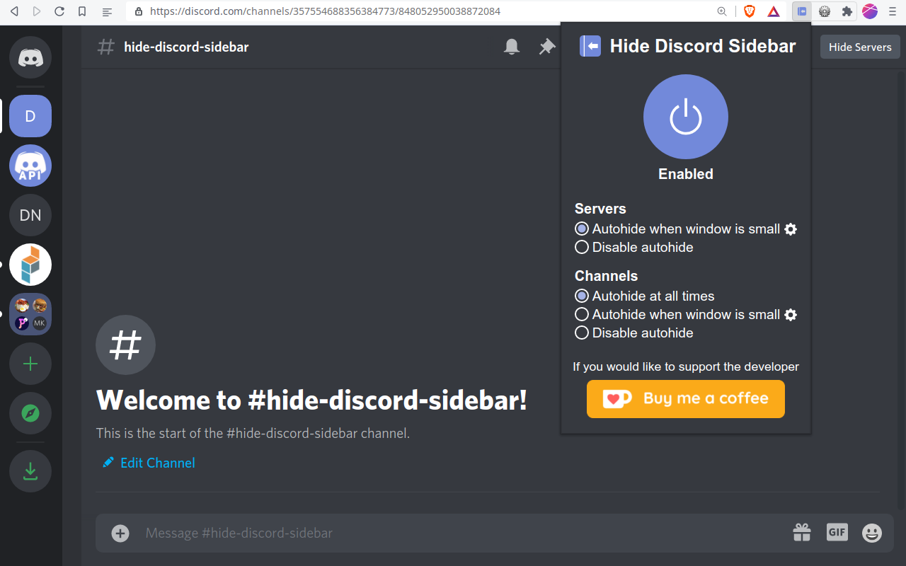

# Hide Discord Sidebar

Chrome and Firefox extension to hide Discord servers and channels

Hide Discord Sidebar minimizes the channels list into a small left sidebar when it is not in use and installs a button on the top right corner to hide/show the Discord server list. Users are able to customise the extension with the popup that shows when the extension button is clicked.

IMPORTANT: This extension is only meant to work on Discord in browsers (discord.com), not the Discord desktop app.

## Support this project

## Copying

This project is licensed under the GNU General Public License v3.0 or later - see the [COPYING](COPYING) file for details
